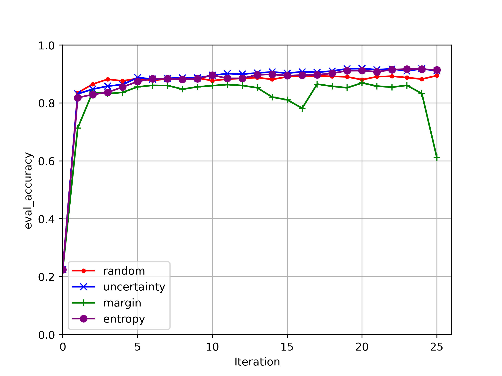

# MDALTH: Modular Deep Active Learning on Torch and Huggingface

MDALTH is a modular library of active learning query algorithms and stopping methods geared towards torch and huggingface users.

## Status

The main branch is currently a pre-release. Our immediate goal is to develop a reasonable API for the stopping methods, tidy up a few other incomplete features, and improve documentation for the system. We hope to release a 0.0 version shortly.

## Examples

All experiments are run with the scripts from `./examples` then analyzed with the `analysis.ipynb` notebook. The overall learning process is very similar for each example, so we only describe it in full in the example directly below. Successive examples will only discuss any parameters that differ.

From `nlp.py`, we fine-tune [distilbert-base-uncased](https://huggingface.co/distilbert-base-uncased) on the [ag_news](https://huggingface.co/datasets/ag_news) dataset. We initially select 64 random examples for labeling, then use active learning to query with a batch size of 64. At each iteration, we finetune the model for 25 epoch in fp16 with AdamW using a batch size of 64. We end training iteration early when validation accuracy on a randomly selected 10% of labeled instances does not increase for two consecutive epochs. We stop active learning after 16 labeling iterations, leading to a total of 64 + (16 * 64) = 1,088 labeled samples out of the 120,000 from ag_news. We then evaluate the best-trained model at each iteration on ag_news's hold-out test set of 7,800 examples and plot the learning curve below.



More examples to follow...

## Setup

Install git and a package manager, e.g., conda on a Linux machine with a GPU (or a cluster with many GPUs, if you have one lying around).

You do you, but we like conda. To create a virtual environment and install the requirements
```
conda create -n MDALTH \
python=3.11 \
pytorch-cuda=11.8 \
pytorch \
torchvision \
torchaudio \
torchtext \
transformers \
datasets \
tokenizers \
accelerate \
scipy \
scikit-learn \
pandas \
matplotlib \
-c pytorch -c nvidia -c conda-forge
conda activate MDALTH
pip install evaluate
```

Obviously, you need to `conda activate` it each time before use. 

We are working on improving the flexibility of our dependencies, but for now, see environment.yml for comprehenisve details about dependency requirements.

Next, clone the repository
```
git clone git@github.com:lkurlandski/MDALTH.git
```

To use mdalth components, you have two choices. You can either work within the MDALTH directory as is done in our examples, or you can pip install MDALTH directly into your environment. To do the latter,

```
pip install -e .
```

See the ./examples directory for examples of how to use MDALTH.

## Similar Libraries

Several Python libraries for active learning have already been proposed, however, have significant disadvantages when compared to MDALTH. Notably, the community still lacks an open-source library of AL stopping methods, which are a crucial aspect of the AL pipeline.

### [ModAL](https://github.com/modAL-python/modAL)

ModAL wraps scikit-learn classifiers, and as such, is ill-suited for deep learning.

### [ALiPy](https://github.com/NUAA-AL/ALiPy)

ALiPy is similar to ModAL and has the exact same shortcommings.

### [deep-active-learning](https://github.com/ej0cl6/deep-active-learning)

While designed to support deep learning through Pytorch, this repo is poorly engineered, documented, and maintained.

### [badge](https://github.com/JordanAsh/badge)

BADGE is forked from deep-active-learning. While it implements some newer querier algorithms, the repository is nowhere near capable of providing a modular toolkit for AL practitioners.

## Contributing

We are interested in collaborating! Message me on Github if you would like to get involved.

### Style

Please consider suggestions from pylint and the associated .pylintrc file. Autoformat with black --line-length=100.

### TODO
- checkpointing system for the Learner and Evaluator
- improve file storage by serializing objects as json instead of pickle
- store the Trainer's log_history for each iteration
- use the newest features from the numpy.typing package to type hint dtypes
- implement utilities to facilitate large-scale stopping method analysis
  - dump stopping method information
  - determine stopping point after AL terminates
