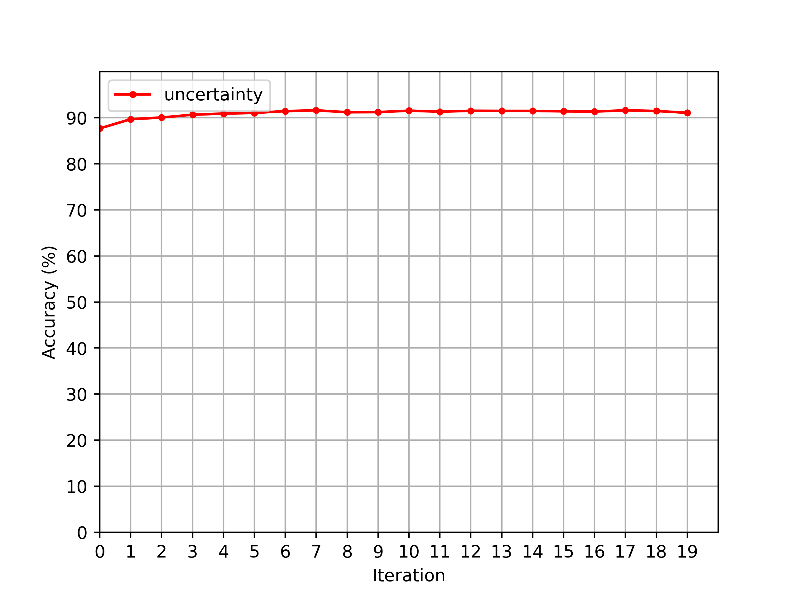
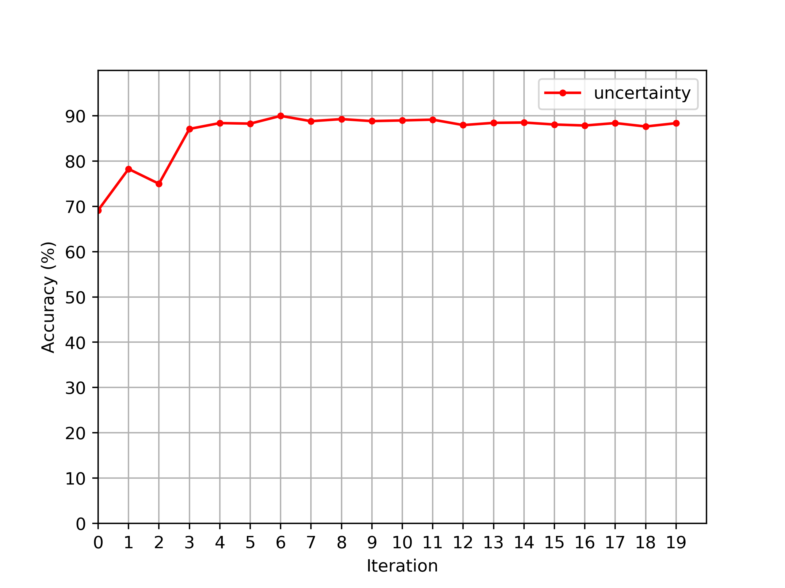

# MDALTH: Modular Deep Active Learning on Torch and Huggingface

MDALTH is a modular library of active learning query algorithms and stopping methods.

## Example

MDALTH allows users to prototype active learning experiments quickly. In the `./example` directory, we developed a very simple project to run active learning experiments for text, image, and audio classification tasks. By adjusting the command-line-arguments, this example can run experiments with many different pretrained models and datasets. In the experiments below, we use a subset of the total available dataset (16384 training/validation examples in the unlabeled pool and 4096 test examples in our simulated hold-out set). We begin active learning by randomly labeling 10% of the unlabeled pool (1638 examples). At each active learning iteration, we query and label 5% of the original unlabeled pool (819) examples. We train each model for 32 epochs using a batch size of 1024 (leveraging gradient accumulation appropriately), but halt learning early if the performance does not improve for three consecutive epochs. The validation set at each iteration is a randomly selected subset of the currently labeled pool (10%). We optimize the networks with Adam (learning rate 1e-5, weight decay 1e-2, warmup ratio 1e-1).

### text classification

- model: [distilbert-base-uncased](https://huggingface.co/distilbert-base-uncased)
- dataset: [ag_news](https://huggingface.co/datasets/ag_news)



### image classification

- model: [google/vit-base-patch16-224-in21k](https://huggingface.co/google/vit-base-patch16-224-in21k)
- dataset: [food101](https://huggingface.co/datasets/food101)



### audio classification

- model: [facebook/wav2vec2-base](https://huggingface.co/facebook/wav2vec2-base)
- dataset: [speech_commands](https://huggingface.co/datasets/speech_commands)


## Setup

Using Python 3.11 and the package manager of your choice, install the following libraries and their dependencies:

```
pytorch-cuda=11.8
pytorch=2.0
transformers=4.32
tokenizers=0.13
datasets=2.14
evaluate=0.4
accelerate=0.22
scikit-learn=1.3
scipy=1.11
```

If you want to run the code in `./example`, you'll need some additional libraries for text/image/audio processing along with data analysis:

```
torchvision=0.15
torchaudio=2.02
soundfile=0.12
librosa=0.10
torchtext=0.15
matplotlib=3.7
pandas=2.0
```

MDALTH will most likely work with a broad spectrum of dependency versions, we just havn't been able to test this yet.

Next, clone the repository and install it locally!
```console
git clone git@github.com:lkurlandski/MDALTH.git
cd MDALTH
conda activate env-MDALTH
pip install -e .
```

You are now ready to use MDALTH!

```python
"""
My awesome module that does awesome stuff!
"""

from mdalth.learning import Learner

# Do awesome stuff!
```

## Similar Libraries

Several Python libraries for active learning have already been proposed, however, have significant disadvantages when compared to MDALTH. Notably, the community still lacks an open-source library of AL stopping methods, which are a crucial aspect of the AL pipeline. Below, we mention some notable active learning codebases and discuss their limitations:

- [ModAL](https://github.com/modAL-python/modAL): ModAL is a highly modular active learning library built on top of scikit-learn. As a consequence, it is ill-suited for deep learning.
- [ALiPy](https://github.com/NUAA-AL/ALiPy): ALiPy is very similar to ModAL and has similar limitations.
- [deep-active-learning](https://github.com/ej0cl6/deep-active-learning): this repository contains a collection of active learning query algorithms for PyTorch, however, it is not a library, and as such, lacks modularity, design, documention, and reliability.
- [badge](https://github.com/JordanAsh/badge): the badge repository is forked from deep-active-learning and suffers the same weaknesses as its predecessor.

## Contributing

We are interested in collaborating! Message me on Github if you would like to get involved or put up a pull request. 

Please consider suggestions from pylint and the associated .pylintrc file. 

```
pylint --rcfile=./.pylintrc mdalth
```

Autoformat with 

```
black --line-length=100 mdalth
```
